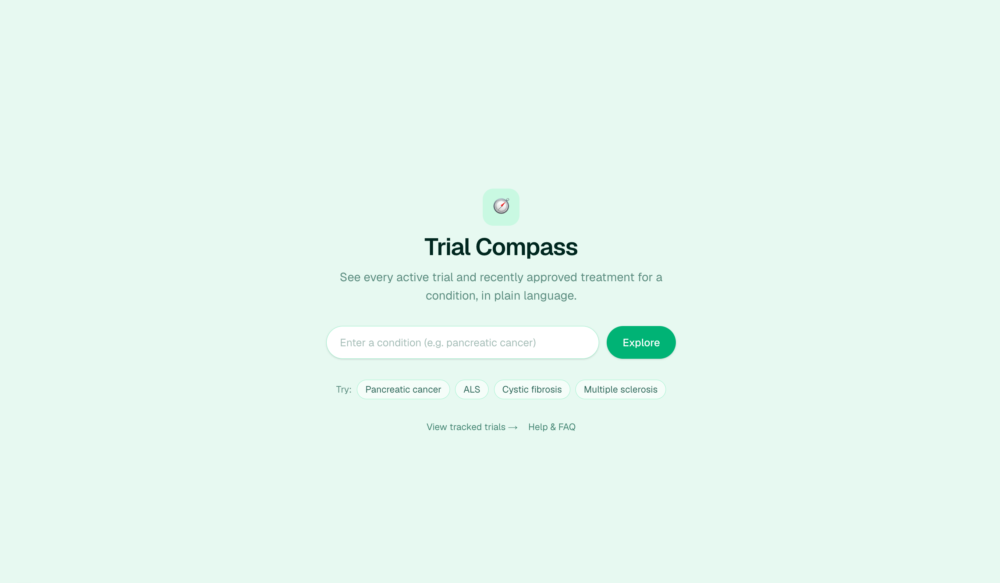
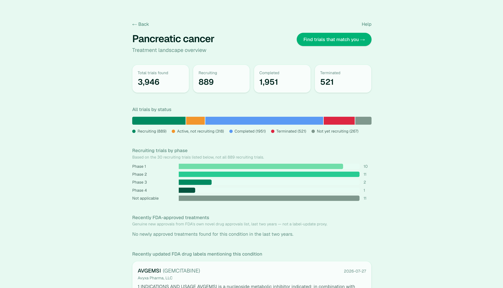
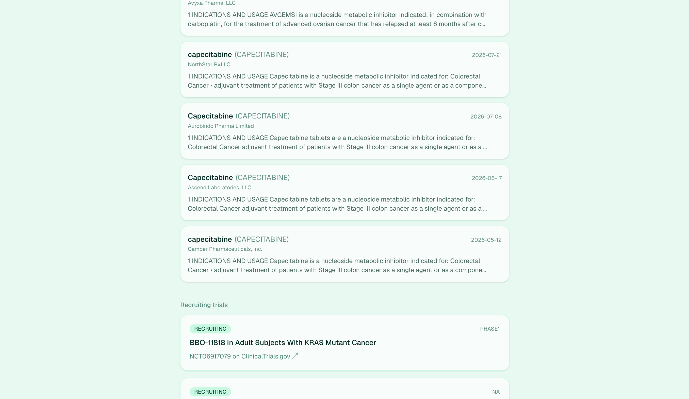
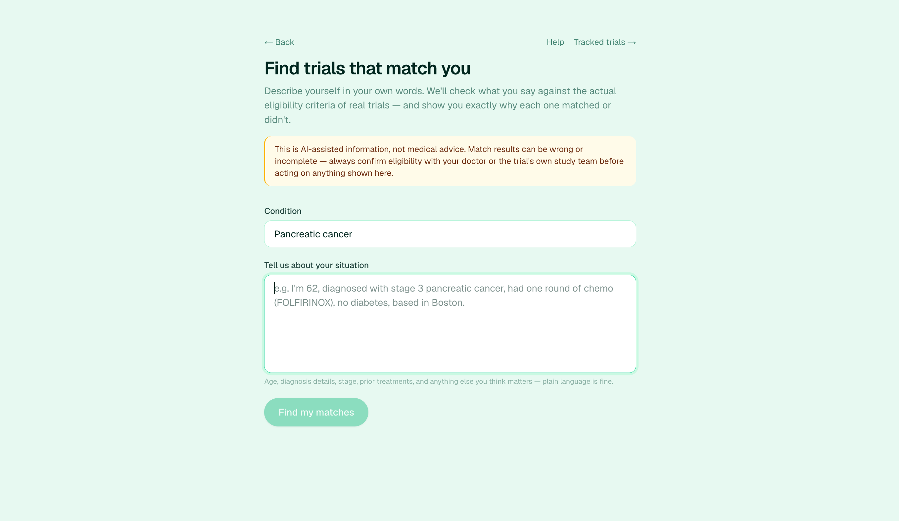

# Trial Compass

See what's happening for a medical condition right now, and whether *you* qualify, in plain language. Backed by real data and an auditable AI verdict, not a black box.

Built for Pharma Hack Day (AWS Builder Loft, SF). Problem statement: treatment observability for patients.

**✅ Problem Statement 3 — fully covered.** Search, live treatment landscape, an explainable/cited eligibility verdict, filters, tracking with a real change feed, and a help center are all built and working end-to-end on real data, no mocks.

## Screenshots

<p float="left">
  
  
</p>
<p float="left">
  
  
</p>

## Why

Patients searching for a diagnosis get either raw ClinicalTrials.gov listings (dense, unreadable) or a chatbot yes/no they can't verify. Neither works for a decision this serious. Trial Compass gives a real verdict with the exact source sentence behind it, so patients can bring it to their doctor instead of just trusting an AI.

## What it does

**Treatment Landscape** (`/landscape/[condition]`). Live trial counts by status/phase, recent FDA label updates, recent novel approvals for the condition. Real-time, no seeded data.

**Explainable Trial Matcher** (`/match`). Patient describes themselves in plain text ("62, stage 3 pancreatic cancer, one round of FOLFIRINOX, no diabetes, Boston"). App extracts a structured profile, runs every recruiting trial through a 3-agent eligibility debate, returns PASS/FAIL/UNKNOWN with confidence, a plain-language summary, and the exact criterion sentence that drove it. Filters (confidence, recruiting status, recency, nearby sites), plus per-trial "what's missing" and "simplify this" on demand.

**Tracking** (`/tracked`). Save a trial, get a plain-language diff (status/site/enrollment/date changes) whenever you recheck it.

**Help Center** (`/help`). FAQ on trial phases/statuses and how the matcher works.

## Why it's worth showing

- Explainable, not black-box: every verdict cites the real criterion text, checked against the trial's actual source in code before it's shown.
- Adversarial, not one-shot: a FOR and AGAINST argument are built independently, then a judge weighs both against the real criteria.
- Confidence enforced in code, capped by what was actually verifiable, not just what the model claims.
- No fake data: everything fetched live from ClinicalTrials.gov, openFDA, FDA.gov.

## Agentic architecture

Seven narrow, single-purpose LLM calls, each with its own schema-validated output (`zodTextFormat`) and its own verification pass in code. No agent has memory or sees another agent's raw output except where the flow below hands it off explicitly. All defined in [`lib/llm.ts`](lib/llm.ts).

| Agent | Trigger | Output | Verification |
|---|---|---|---|
| Profile extractor | intake text submitted | structured profile (age, diagnosis, stage, treatments, biomarkers, comorbidities, location) | explicit absences ("no diabetes") kept as facts, not null |
| Qualification (FOR) | per trial | argument + verbatim cited criteria | citation checked against source text |
| Disqualification (AGAINST) | per trial, parallel with FOR | argument + verbatim cited criteria | same |
| Judge | after FOR + AGAINST | verdict, confidence, per-criterion met/not_met/unknown, primary citation | each criterion re-checked as substring of real text, unverifiable → `unknown` |
| Missing Information | trial detail opened | 1-3 criteria worth asking about, plus why | filtered to only items matching real unknown-criteria list |
| Simplify | trial detail opened | criteria rewritten at 2 reading levels | rejected if output array length mismatches input |
| Eligibility-diff summary | tracked eligibility text changed | one-sentence plain summary | only called after a real diff is detected |

### The eligibility debate, in detail

This is the core flow, run once per trial per match request:

```
Patient profile + trial's real eligibility text
        │
        ├── Qualification agent (FOR):      argues honestly, cites verbatim criteria
        └── Disqualification agent (AGAINST): argues honestly, cites verbatim criteria
                    │            (run in Promise.all, neither sees the other)
                    ▼
              Judge agent: weighs both vs. real criteria, never splits the difference
              → verdict, confidence, per-criterion (met/not_met/unknown), primary citation
                    │
                    ▼
        Code-level guardrails (not the model's word):
        • every cited criterion re-checked as a real substring of the trial's own text
        • verdict downgraded to UNKNOWN if it contradicts the judge's own verified criteria breakdown
        • confidence capped: UNKNOWN → 40 max, unverified citation → 50 max,
          PASS with under half its criteria checkable → 50 max
                    │
                    ▼
        TrialMatch shown to patient, results sorted PASS → UNKNOWN → FAIL, then by confidence
```

Debate not single-call: one model asked "does this qualify" settles on whatever sounds plausible first. FOR/AGAINST built independently, judge reconciles both against real text, surfaces actual ambiguity.

Judge still not trusted blind: `reconcileVerdict()` downgrades to UNKNOWN if the top-line verdict contradicts the judge's own verified per-criterion breakdown (PASS with a verified `not_met`, or FAIL with none).

Confidence capped in code, not just prompted: `applyConfidenceGuardrails()` runs regardless of what the model claims, so a fluent but under-evidenced verdict can't read as 90% confident.

## Design decisions

- **Verification in code, not prompts.** `isCitationVerified()` checks a claimed quote is a real substring of the trial's actual text; anything that fails is unverified, full stop.
- **Server re-verifies client state.** `/api/trial-insights` re-derives verified criteria server-side before calling Missing Information or Simplify, no trusting client payloads.
- **Defensive parsing.** `stripLeakedJson()` trims text fields where the model's own JSON syntax leaks into a string value.
- **LLM only where input is genuinely free-form.** Profile extraction, the debate, diff summaries, simplification. Filtering, proximity match, snapshot diffing stay plain deterministic code.
- **Fail visibly.** No API key → `503`, not a fabricated verdict. Mismatched `simplifyCriteria` output gets discarded, not guessed.

## Stack

Next.js (App Router, TS, Tailwind v4). No separate backend, no database. Trial/FDA data fetched live; tracked trials live in `localStorage`.

```
app/
  landscape/[condition]/   treatment landscape
  match/                   explainable trial matcher
  tracked/                 tracked trials + change feed
  help/                    FAQ
  api/{trials,match,eligibility,trial-insights,track/check}/
lib/
  clinicaltrials.ts   openfda.ts   novelApprovals.ts     (data sources)
  llm.ts                                                  (all prompts + verification guardrails)
  trialFilters.ts   trialDiff.ts   tracking.ts   faq.ts
```

## Run it

```bash
npm install
npm run dev
```

Open `localhost:3000`. Landing and landscape work with no setup. For the matcher, tracking summaries, and simplification, set `OPENAI_API_KEY`. Without it, those routes return `503` instead of faking output.

## Ideas to extend

Convoke pipeline data integration, voice/chat intake, multi-language summaries, per-trial "how to enroll", side-by-side condition comparison, FDA approval timeline view.
